---
title: "PPM Project Report - Group Kii"
author: [Callum Axon (N0727303), Callum Carney (N0741707), Jordan Brightmore (N0732961), Finlay McKinnon (N0743587), Vital Harachka (N0731739), Wing Chiang (T0086366)]
subtitle: "Magnus Frater System"
lang: "en"
logo: "./images/ntu-logo.png"
logo-width: 60
linkcolor: darkgray
titlepage: true
titlepage-color: "06386e"
titlepage-text-color: "FFFFFF"
titlepage-rule-color: "FFFFFF"
titlepage-rule-height: 1
header-includes: |
	\usepackage{pdflscape}
...

[comment]: <> (pandoc --filter pandoc-citeproc --bibliography=./references.bib -s ppm.md -o project.pdf --template eisvogel)

# Abstract

Magnus Frater (or Big Brother) has been created to help tackle the ongoing issue of security within large open campuses and premises, these sorts of locations inherently have an increased potential for intrusion through unmonitored sections of land. The group analysed the recent spree of attacks on schools and offices - for example the shooting that occurred at the YouTube headquarters in 2018 [@agencies_2018] - and found that in a large amount of these attacks there were open doors and spaces that allowed the attacker to enter with ease. As a consequence to this, the idea of creating a facial recognition system to analyse and report known and unknown people within a campus/large open setting was conceived.

As mentioned, the main purpose of the project was to create a system that would accurately detect and report people walking around an area to the associated security team, this data would differentiate between employees or authorised users and unknown people by linking into the companies employee/student database. Not only would this allow a security team to monitor who is within a set area at any one time, but it would also allow administrative users to track any persons movements and activities within a set time frame, through tracking of the targets face across multiple cameras. Another advantage to this project is that administrative users can view analytics in relation to the usage of campus properties, an example use case for this would be within a University. Admins could check what buildings within the campus are being utilised most by students.  

After the main purpose behind the project was defined, the group decided on how to proceed in regards to the requirements for the project, most importantly how we should proceed with splitting up the individual hardware and software components so that the system could functions within any scenario or environment. It was decided that there will be 4 different modules, these being:

1. A Raspberry Pi that would be responsible for processing any facial data that is captured by the camera
2. A Camera module that would connect directly to the Raspberry Pi and provide images to the Raspberry Pi
3. A website created for administrators and security personnel to administer and manage hits/rejections.
4. An API (Application Programming Interface) used within the website and the Raspberry Pi for collation and provision of data.

These modules will work together to create the Cameras that report facial data and the web interface that is used to manage the data received by the camera, the connection between these modules was outlined in the design documentation (for example the Data Flow Diagram and Entity Relationship Diagram).

Once the components and requirements were completed, the group began to consider which programming languages and setups would be best suited for the type of project this is (Facial Recognition with Web Related components). It was clear that Python should be used for the facial recognition section of the project due to its strong existing libraries. NodeJS would be used for the Web Frontend, PHP would be used to power the backend API that links all of the components together and the API would be using a MySQL database to hold all of the data. The system would work in the following way:

1. The Camera feeds data to the Raspberry Pi
2. The Python application on the Raspberry Pi calculates if a face is present
3. Any potential face found is sent to the API where corresponding facial data is requested from the database
4. If no corresponding data is found, then the face is unknown, otherwise the image will be linked to the person the face associates with.
5. The Website will update using data from the API to show new detections, known or unknown.

Once the product had been developed, testing took place to ensure that the facial recognition software worked from a variety of different distances and in unfavourable circumstances (heavy rain, fog, etc). While some of the tests passed, others failed to detect faces when they were present, however this only occurred in extreme circumstances. We made small enhancements to the facial detection algorithm to improve its effectiveness during these scenarios.

Due to the nature of this system, there are a lot of potential legal and ethical issues, people may not consent to the recording of their faces, people may not wish to have their faces processed and stored by this system. Therefore it was important for us to implement a blacklist system that would stop the system from performing facial data processing, however, this is a complex system because we first need to process a persons face to understand what to blacklist, which could cause further legal or ethical issues. 

\newpage

# Table of Contents
- [Abstract](#abstract)
- [Table of Contents](#table-of-contents)
- [Introduction](#introduction)
	- [Project Aims](#project-aims)
	- [Objectives](#objectives)
- [Existing Solutions](#existing-solutions)
	- [Product Demand](#product-demand)
		- [Organisations](#organisations)
		- [Consumers](#consumers)
- [Project Management](#project-management)
	- [Meetings](#meetings)
		- [General Absence](#general-absence)
		- [Authorised Absence](#authorised-absence)
		- [Absence Procedure](#absence-procedure)
	- [Management](#management)
		- [Project Manager](#project-manager)
		- [Task Allocation](#task-allocation)
	- [Team Members, Responsibility & Skills](#team-members-responsibility--skills)
- [Risk Assessment](#risk-assessment)
- [Requirements](#requirements)
	- [Functional Requirements](#functional-requirements)
	- [Non-Functional Requirements](#non-functional-requirements)
- [Normalisation](#normalisation)
- [Context Diagram](#context-diagram)
- [GANTT Chart](#gantt-chart)
- [Logical ERD](#logical-erd)
- [Process flow for Camera](#process-flow-for-camera)
	- [Algorithm Explanation](#algorithm-explanation)
		- [Facial Detection](#facial-detection)
		- [Facial Recognition](#facial-recognition)
	- [BCS Code of Conduct](#bcs-code-of-conduct)
- [Discussion / Conclusion](#discussion--conclusion)
	- [Social, Legal & Ethical Issues](#social-legal--ethical-issues)
	- [Future Work](#future-work)
- [Appendix](#appendix)
	- [Use Cases](#use-cases)
	- [Test Plan](#test-plan)
	- [Screen Designs](#screen-designs)
		- [Login](#login)
		- [Dashboard](#dashboard)
		- [Statistics](#statistics)
		- [Admin](#admin)
		- [User Profile](#user-profile)
		- [Elements Appendix](#elements-appendix)
	- [Test Plan](#test-plan-1)
	- [UI Screenshots](#ui-screenshots)
		- [Login Page](#login-page)
		- [Dashboard](#dashboard-1)
		- [Administrative Dashboard - Users](#administrative-dashboard---users)
		- [Administrative Dashboard - Buildings](#administrative-dashboard---buildings)
		- [Administrative Dashboard - Cameras](#administrative-dashboard---cameras)
		- [Alerts](#alerts)
		- [User Profile](#user-profile-1)
	- [Questionnaire Responses](#questionnaire-responses)
- [References](#references)

\newpage

# Introduction

Over recent years, especially in the United States, attacks on schools or open campus locations have been increasing at an alarming rate.

{width=50%}[@glidermaven]

As you can see in the image above, there is a clear increase in mass shootings over the past few years, with a large percentage of these happening within schools or large open spaces. Current technology to prevent school shootings relies on hardening access to portions of the school or alerting people inside of an attack (through door barriers or locks and SMS messaging), however, this occurs after the shooting has begun and does not help to prevent the attack occurring in the first place.

Based on these findings, it can be deduced that there needs to be technology implemented that helps to prevent an attack happening, rather than lessening the impact of an attack. This is where our projects objectives come into play, our technology will help to identify unknown people within a school or campus, before they even enter the building. Automatically alerting security personnel so that they can investigate further.

We believe that this technology could greatly decrease the amount of potential attacks and could serve as a deterrent to people who want to commit a crime within an establishment that has the system installer.

Furthermore, the system could be improved to link with local police facial databases in order to identify known criminals who are attempting to enter a school or other location.

\newpage	

## Project Aims
The main aim of the project is to provide organisations with open campus settings a way to effectively track and monitor who is on campus and where they are located at any time of day. This is to help reduce or prevent intrusions and attacks that occur on these types of locations.

## Objectives

To ensure clear and appropriate objectives have been created for the project, the S.M.A.R.T. (specific, measurable, achievable/appropriate, realistic, time-constrained) goals [@doran1981there] were used. SMART allows us to create objectives that provide the project with lots of functionality, that will be meaningful to the objects, and still stay within the projects deadlines. For the project to be successful the following objectives should be met:

Staff Members should be able to:

* Add new faces or people to the system through a simple yet effective web interface 
* Monitor the movements of people across buildings and campuses, whether they are registered as people or not
* Manage alerts of unknown people entering the campus
* Provide temporary passes to unknown people to authorize them for a set amount of time;

As a requirement to this, the camera and associated Raspberry Pi module should be able to provide the following:

* A stream of video that can be analysed by the algorithm on the Pi in order to find faces;
* A constant stream of face detections to the central server that manages all hits;

In general the following objective should be met:

* The camera and web interface should be able to talk to each other through an API (Application Programming Interface)

To meet the objectives set out for Staff Members, the group will be creating a web interface using NodeJS, this interface will have the functionality set out above and will interface with the API to get and set data. It was mentioned that the interface should be simple yet effective, we could easily bombard the user with a lot of metadata from the cameras, however, the web interface will only show the required information and actions to ensure that a staff member can quickly and easily identify if there is an intruder currently on campus. All of the outlines objectives are achievable and can be implemented in a timely manner.

To meet the requirements set out for the Raspberry Pi and API, we will have to ensure substantial testing of the facial detection algorithm takes place, the group wants to avoid experiencing a scenario in which multiple people are not identified. However, the algorithm cannot be 100% effective, there will always be scenarios in which the algorithm misses a person, or mis-identifies them, it would be unrealistic and a waste of development time to be chasing after a 100% success rate. We will also have to ensure that the API is tested thoroughly, not only for functionality, but for security purposes, if an attacker gained access to another users facial data then this would be a breach of GDPR, therefore we will be implementing multiple security procedures to ensure that the API is secure, including the use of security based unit testing and manual testing.

\newpage

# Existing Solutions

Due to how niche this product is, there are few products available on the market, however there is one product avaliable in the United States that has been implemented in various locations and links with Police Databases (which is a further goal for our product). You can find some more information relating to the features, strengths and weaknesses of this product below

| Product                   | Features                                                               | Strengths                                                                                                                                                         | Weaknesses                                     |
| ------------------------- | ---------------------------------------------------------------------- | ----------------------------------------------------------------------------------------------------------------------------------------------------------------- | ---------------------------------------------- |
| FaceFirst (facefirst.com) | Facial Recognition Abilities, Police Database Link, Real Time Alerting | Links into Police Databases allowing for detection of Criminals, Multiple use case scenarios (Casinos, Campus Security, Authentication), Has an API/SDK Available | Expensive, Only available in the United States |

## Product Demand

### Organisations

While there is no direct demand for this product, this could just be down to the fact that organisations and people do not know that this technology is possible and that it can be easily installed into their campuses. With more visibility around this product we believe that there would be significant interest, especially from Universities and Companies with open campuses in the United States. After conducting market research, it was discovered that some organisations in China have adopted the facial recognition approach for identifying users [@china-facialrec] and that it is working well for the organisations in question. [@china-facerec]

The unfortunate upward trend of school shooting and attacks on open campuses will lead to more interest in facial recognition software to help prevent, rather than lessen the impact of an attack.

### Consumers

Due to the potential ethical issues that could arise from an organisation using this type of product, the group was interested in seeing if consumers would approve of this type of technology being used. We released a form which asked the following questions

1. Would you personally consent to having your face scanned when entering a location?
2. Would you personally consent to having your location tracked in real-time by a human being through the use of facial recognition?
3. Would you feel safer at a location if you knew that Facial Detection was occurring (where faces are compared to known people and unknown people are flagged)
4. Would you personally consent to your tracking data being aggregated and used for statistical purposes?

In regards to question 1, 91% of respondents agreed to having their face scanned when entering a location, this is a great response rate because without consumer support, this product would not be able to work effectively for an organisation.

In regards to question 2, 83% of respondents agreed to having their location tracked by a human being, this is a decrease from the previous question, and was expected by the group due to the privacy violations that could be argued when tracking someones location constantly.

In regards to question 3, 95% of respondents agreed that they would feel safer at a location if they knew that Facial Detection is occurring, this is excellent to see as it shows that the product would have a profound difference to consumer safety.

In regards to question 4, 87% of respondents agreed to having their data aggregated and used for statistical purposes, this is an interesting difference from question 2 and shows that consumers are happier to have their information aggregated and used but not while being targeted specifically.

You can see the full results in the [Questionnaire Responses](#questionnaire-responses) section of the document.

\newpage

# Project Management

## Meetings
Group meetings should occur at least once a week during term
time.This may be altered and increased dependent on any deadlines
that the group decide are enough of an impact to call extra meetings.
The current meetings have an estimated length of 30 minutes to an hour,
being held in a work-appropriate environment, such as a meeting room. IT can be useful to utilise software which allows the use of voice communication to enable remote working.
It is possible that there will be instances in which not all the group will
be able to meet. This may be caused through a great many scenario, each
of which should be able to be resolved, given consideration and following a
standard procedure. Some of the scenarios, and correct procedures to take
in the event of said scenario, can be seen below:

### General Absence
In the case of a general absence, being that a member of the group is absent
without meaningful reason, the group may have to consider the situation
the absent member may be in. The consideration being the current group
position, the importance of the absent member’s role, or contribution that
may have been needed in the current session. In this event, the group may
need to note down the general absence and keep track of the amount each
member has committed, as many of these may show a lack of commitment
to the project. A given example of this scenario is - ”Marcus missed the
meeting because he went to go see a movie.”

### Authorised Absence

In the event of an authorised absence, in which the member who is absent has
given compelling reason and possibly proof if required, the member would
be excused from the current session. For this scenario to be distinguishable
from a general absence is down to a few possibilities: forewarning of absence
with given reasoning and a group consensus to pass this absence, an event in
which the member would not be able to attend due to reasoning outside of
their control, or an unavoidable event where the member has no real ability
to alter A given example of this scenario is - ”Jess couldn’t make it to the
meeting as she had a medical appointment.”

### Absence Procedure

In either of the circumstances mentioned above, the same procedure is taken.
This is to ensure that the missing member will be able to catch up on the
meeting that they missed, allowing for minimal drawbacks from the absence.
For a team member to be considered ’fully informed, for the meeting of
absence, the team must follow the stages below. A team member(s) who was
present in said meeting must contact the absentee, giving a small briefing
as well as the minutes of the meeting. This should be followed with any
decisions or changes decided within the meeting, if not already noted down
in the minuets. Furthermore, the absentee should be asked if they have
any questions about the information given to them, to ensure that they are
sound minded on the group’s current position, as well as each individual’s
tasks.

## Management

### Project Manager

A member should be elected as Project Manager (PM), the role responsible
to tracking information on the group members, as well as being the first to
act on any events which may disrupt the project. PM will handle the attendance
of the group during all forms of meetings, as well as the punctuality
of tasks from each of the group. It will be the PM’s duty to talk to any
members who show deviation from a consistent work ethic, ensuring that
the member knows their tasks and is on track. If the PM finds the need to
call a discussion with the group on a member’s behaviour and commitment
toward the project they can initiate a vote to exclude the member from the
group, with warning and consultation. The PM may find it useful to pass off a secondary role to another team member to ensure that the project is
being fully watched. The deputy should report back to the PM with any
extra information they have found to be added to their current information
on the group.

### Task Allocation

For the group to work as well as they can with minimal conflict, when a
task is presented to the group they will be asked to whom would like to take
on said task. If there is a conflict on the task allocation, it may be able
to split the task into smaller subtasks; thus, allowing for multiple members
to work on it. However, if the situation does not allow for this then a
fair discussion will be made to decide which member will be assigned the
task. Upon being assigned a task, the member will be given a deadline
for the task to be complete, the deadline may be flexible, allowing for the
member to negotiate and discuss with the team. When each member of the
team is working on a task, the PM will ask for progress reports at intervals
throughout each task. The PM will report to the team if any anomalies
occur, allowing the team to propose ideas to ensure completion before its
deadline.

\newpage

## Team Members, Responsibility & Skills

**Project Manager**: Callum Axon 

| Name              | Responsible For             | Relevant Skills                                           |
| ----------------- | --------------------------- | --------------------------------------------------------- |
| Callum Axon       | Backend Database & API      | - PHP - MySQL - UML Tooling - Testing - Server Management |
| Callum Carney     | Monitoring Application      | - HTML & CSS - JavaScript, Testing                        |
| Finlay McKinnon   | Monitoring Application      | - HTML & CSS - Screen & Graphic Design                    |
| Jordan Brightmore | Facial Recognition Software | Python - Machine Learning - Raspiban - Computer Vision    |
| Vital Harachka    | Backend Database            | SQL - PHP                                                 |
| Wing Lam Chiang   | Documentation & Database    | SQL - PHP - Project Management Software                   |
\newpage

# Risk Assessment

| ID   | Description                                                                                 | Impact    | Probability | Response                                                                                                                                                                                                                                                                                                                                                           |
| ---- | ------------------------------------------------------------------------------------------- | --------- | ----------- | ------------------------------------------------------------------------------------------------------------------------------------------------------------------------------------------------------------------------------------------------------------------------------------------------------------------------------------------------------------------ |
| RE1  | Team member is ill, injured or cannot work on project due to personal reasons               | High      | Medium      | Reorganise workload to cover team member.                                                                                                                                                                                                                                                                                                                          |
| RE2  | Team member does not attend meetings due to a busy university schedule                      | Medium    | Low         | Organise more meetings at a common available time. Alternatively, use a digital solution                                                                                                                                                                                                                                                                           |
| RE3  | Team member consistently not doing work, time schedule falls at least a week behind         | High      | Medium      | Assign multiple members to the same task - enabling redundancy                                                                                                                                                                                                                                                                                                     |
| RE4  | Data Loss                                                                                   | High      | Low         | Ensure a regular backup of work is taken. Use version control systems (VCS) for code & store in cloud.                                                                                                                                                                                                                                                             |
| RE5  | Deadline Changes                                                                            | Medium    | Low         | If deadline is earlier than before, change work schedule to account for it.                                                                                                                                                                                                                                                                                        |
| RE6  | Missed Internal Deadlines                                                                   | Very High | Low         | Workload reorganised to complete project ahead of schedule, meetings to identify problems causing missed deadlines.                                                                                                                                                                                                                                                |
| RE7  | Team member leaves module/course                                                            | Very High | Low         | Assign multiple members the same task, enabling redundancy, also ensure that all team members have open communication methods so that an early warning can be provided                                                                                                                                                                                             |
| RE8  | Domineering personalities                                                                   | Low       | Low         | If there is a dominant personality in the group which causes other members to feel unable to contribute, then limits could be made on individual contributions, also it is important that when members are speaking they have no interruption. Remind all the members of the group that it is important to hear and respect all opinions in relation to the topic. |
| RE9  | Working with team members during non-term time                                              | Medium    | Low         | If it is required for us to work with team members during non-term time then it will be important for us to have good communication so that all the team members still know what their roles are and what work need to be completed.                                                                                                                               |
| RE10 | ICT resources may not be adequate or appropriately available for the demands of the project | Medium    | Low         | If ICT resources are inadequate then consider using external sources to reach the goals needed to complete the project to a good standard.                                                                                                                                                                                                                         |
| RE11 | Team members finding topics or concepts difficult to grasp                                  | Medium    | Medium      | Try help the team member to understand the topic they’re working on, however if they still don’t understand suggest a switch of topic or role on the project.                                                                                                                                                                                                      |

\newpage

# Requirements
 
## Functional Requirements

| FR# | Function                                                          | Goal                                                                                                                       | Actor                 | Justification                                                                                                                                                                                          | Importance Rating (out of 5)                                                                                                                                                        |
| --- | ----------------------------------------------------------------- | -------------------------------------------------------------------------------------------------------------------------- | --------------------- | ------------------------------------------------------------------------------------------------------------------------------------------------------------------------------------------------------ | ----------------------------------------------------------------------------------------------------------------------------------------------------------------------------------- |
| 1   | Face Scanning                                                     | A stationary camera is able to detect a face and scan certain data points for analysis                                     | Stationary Camera     | In order to provide a product that tracks people on a large campus, we must have an effective face scanning algorithm to track people across cameras                                                   | 5 - This functionality is required for the system to work                                                                                                                           |
| 2   | Position Reports can be filed                                     | Once a person has been identified all of the associated metadata is compiled and submitted as a report to the API          | Camera - Raspberry Pi | In order to provide person tracking functionality the API must recieve compiled position reports to query at a later date, without these the application would loose a large portion of functionality. | 5 - This functionality is required for the system to work properly                                                                                                                  |
| 3   | New facial data can be added to the system                        | An administrative user must be able to upload new facial data to be detected at a later point in time                      | Administrative User   | In order to match new faces to current people, an original image of a persons face must be uploaded to the system so that the two images can be compared at a later date                               | 5 - FR4 requires this function to exist                                                                                                                                             |
| 4   | New facial data is processed when uploaded to the web interface   | Once an image of a person has been uploaded the associated facial data points are created and stored                       | API                   | In order to compare two faces, the system needs to generate data points from the two images and then compare the data points to calculate who has been detected                                        | 5 - Without this functionality the system would not be able to discover people                                                                                                      |
| 5   | A person can be discovered when they have a valid position report | If a member of the security team is looking for a person, they can search and find the related position reports            | Security Personnel    | A person must have position reports associated with them to allow the security team to search for them and discover their past or present location                                                     | 3 - The application will still function without this, however a large piece of functionality would be missing                                                                       |
| 6   | A person can be located within a Campus/Location                  | A person must be able to be located within a campus setting.                                                               | Security Personnel    | In order to allow security personnel to find people within a certain location, there must be functionality to discover a person.                                                                       | 3 - The application will still function without this, however a large piece of functionality would be missing                                                                       |
| 7   | A temporary pass can be assigned to a person                      | In order to be able to allow unknown users to walk around a campus without causing alerts a temporary pass can be assigned | Security Personnel    | In order to lower the amount of False Negatives within a system, administrators can assign temporary passes that will allow unknown people to walk around the campus without causing alerts            | 4 - The application will still function without this, however a very important feature would be missing                                                                             |
| 8   | List Campuses                                                     | Display a list of Campuses                                                                                                 | Web Interface         | In order to display required information to users of the system, there must be functionality to display added campuses                                                                                 | 4 - The application will still function without this, however a very important feature would be missing                                                                             |
| 9   | Add Campuses                                                      | Add a Campus                                                                                                               | Web Interface         | In order to manage buildings, campuses must be added so that buildings can then be associated with them                                                                                                | 5 - This functionality is required for the system to work properly                                                                                                                  |
| 10  | Remove Campuses                                                   | Remove a campus                                                                                                            | Web Interface         | A campus may no longer be required or may be phased out, therefore the ability to remove campuses must be included                                                                                     | 4 - The application will still function without this, however a very important feature would be missing                                                                             |
| 11  | List Buildings                                                    | Display a list of buildings                                                                                                | Web Interface         | In order to display required information to users of the system, there must be functionality to display added buildings                                                                                | 4 - The application will still function without this, however a very important feature would be missing                                                                             |
| 12  | Add Buildings                                                     | Add a building                                                                                                             | Web Interface         | In order to manage cameras, buildings must be added so that cameras can then be associated with them                                                                                                   | 5 - This functionality is required for the system to work properly                                                                                                                  |
| 13  | Remove Buildings                                                  | Remove a building                                                                                                          | Web Interface         | A building may no longer be required or may be phased out, therefore the ability to remove buildings must be included                                                                                  | 4 - The application will still function without this, however a very important feature would be missing                                                                             |
| 14  | Add Cameras                                                       | Add a camera                                                                                                               | Raspberry Pi          | In order to link person discovered with cameras a camera must first be enrolled onto the system, this occurs within the Python applications code                                                       | 5 - This functionality is required for the system to work properly                                                                                                                  |
| 15  | List Cameras                                                      | Display a list of Cameras                                                                                                  | Web Interface         | In order to display required information to users of the system, there must be functionality to display added cameras                                                                                  | 4 - The application will still function without this, however a very important feature would be missing                                                                             |
| 16  | Update Cameras                                                    | Update a camera                                                                                                            | Web Interface         | A camera may have its location or information changed therefore, there must be functionality to update added cameras                                                                                   | 4 - The application will still function without this, however a very important feature would be missing                                                                             |
| 17  | Remove Cameras                                                    | Remove a camera                                                                                                            | Web Interface         | A camera may no longer be required or may have been phased out therefore, there must be functionality to delete added cameras                                                                          | 4 - The application will still function without this, however a very important feature would be missing                                                                             |
| 18  | List Users                                                        | List Users                                                                                                                 | Web Interface         | Administrators need to be able to list users to see who is administrating their system and what people have been registered                                                                            | 4 - The application will still function without this, however a very important feature would be missing                                                                             |
| 19  | View Users                                                        | View Users                                                                                                                 | Web Interface         | Administrators should be able to view user profiles which should include statistics in regards to current and previous locations                                                                       | 3 - If possible, the system should have this implemented as it would be an excellent feature to have, however it is not critical to the functioning of the system                   |
| 20  | Add Users                                                         | Add Users                                                                                                                  | Web Interface         | Administrators need to be able to add users to the system, this could be for administrative purposes or just adding a low level user                                                                   | 4 - The application will still function without this, however a very important feature would be missing                                                                             |
| 21  | Remove Users                                                      | Remove Users                                                                                                               | Web Interface         | Administrators need to be able to list users to see who is administrating their system and what people have been registered                                                                            | 4 - The application will still function without this, however a very important feature would be missing                                                                             |
| 22  | List Statistics                                                   | List Statistics                                                                                                            | Web Interface         | Administrators should be able to look at statistics of their systems for example, what location is most popular, etc                                                                                   | 2 - The application does not need or require this functionality, it is purely a quality of life improvement, however it would be a great advantage for administrators of the system |
| 23  | React to Alerts                                                   | React to Alerts                                                                                                            | Web Interface         | Administrators and security personnel must be able to react (false negative, resolved) to alerts of unknown users on Campus in order to remove an unknown user listing                                 | 5 - The core objective of this system is that organisations can react to unknown people activity, therefore this functionality needs to be included                                 |

\newpage

## Non-Functional Requirements

| NFR# | Function | Goal | Actor | Importance Rating (out of 5) |
| ---- | -------- | ---- | ----- | ---------------------------- ||
| 1    | Be usable        | The system should be usable by any users with varying levels of computer proficiencies             | Administrators   | 5                            |
| 2    | Performance      | The system should be fast and responsive when administrators are using the Web Interface           | Administrators   | 4                            |
| 3    | Be easy to setup | Cameras should be easy to setup and link into the web interface                                    | System Installer | 3                            |
| 4    | Automated Backup | The system should have an automated backup for the facial data to prevent loss of authorised users | Administrators   | 3                            |
| 5    | Language         | The system should have a variety of languages available in order to cater for non english speakers | Administrators   | 2                            |
| 6    | Security         | The system should be inherently secure and all data should be held in a secure facility/location   | Administrators   | 5                            |

\newpage

# Normalisation

| UNF                          | 1NF                          | 2NF & 3NF           |
| ---------------------------- | ---------------------------- | ------------------- |
| *Person ID                   | **Person**                   | **Person**          |
| Person First Name            | \*Person ID                  | \*Person ID         |
| Person Last Name             | First Name                   | First Name          |
| Date of Birth                | Last Name                    | Last Name           |
| Gender                       | Date of Birth                | Date of Birth       |
| Camera ID                    | Gender                       | Gender              |
| Camera Name                  |                              |                     |
| Camera Address               | **Camera**                   | **Camera**          |
| Camera Active Flag           | \*Camera ID                  | \*Camera ID         |
| Campus Name                  | Camera Name                  | #*Building ID*      |
| Campus Address               | Camera Address               | Name                |
| Campus City                  | Camera Active Flag           | Address             |
| Campus County                | Campus Name                  | Active Flag         |
| Campus Postcode              | Campus Address               |                     |
| Building Name                | Campus City                  | **Campus**          |
| Position Report ID           | Campus County                | \*Campus ID         |
| Position Report Camera       | Campus Postcode              | Name                |
| Position Report Building     | Building Name                | Address             |
| Position Report Campus       | Position Report ID           | City                |
| Security Alert ID            | Security Alert ID            | County              |
| Security Alert Camera        | Security Alert Timestamp     | Postcode            |
| Security Alert Timestamp     | Security Alert Actioned Flag |                     |
| Security Alert Actioned Flag |                              | **Building**        |
|                              |                              | \*Building ID       |
|                              |                              | #*Campus ID*        |
|                              |                              | Name                |
|                              |                              |                     |
|                              |                              | **Security Alert**  |
|                              |                              | \*Security Alert ID |
|                              |                              | #*Camera ID*        |
|                              |                              | Timestamp           |
|                              |                              | Actioned Flag       |

\newpage

# Context Diagram

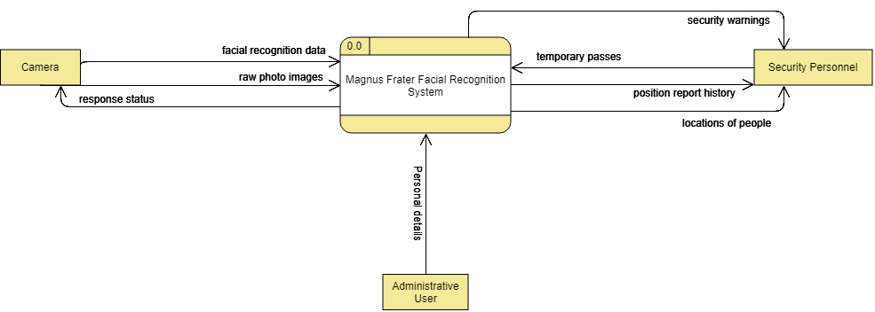

\newpage

\begin{landscape}

\pagestyle{empty}

\hypertarget{level0dfd}{%
\section{Level 0 DFD}\label{level0dfd}}

\begin{figure}
    \makebox[\linewidth]{
		\includegraphics[width=0.90\linewidth]{images/ppm-images/level-0-dfd.png}
    }
	\caption{Level 0 DFD} \label{fig:level0dfd}
\end{figure}

\end{landscape}

\newpage

\begin{landscape}

\pagestyle{empty}

\hypertarget{cmap}{%
\section{Concept Map}\label{cmap}}

\begin{figure}
    \makebox[\linewidth]{
		\includegraphics[width=1.05\linewidth]{images/ppm-images/cmap.jpeg}
    }
	\caption{Concept Map} \label{fig:cmap}
\end{figure}

\end{landscape}

\newpage

\begin{landscape}

\pagestyle{empty}

\hypertarget{deployment-diagram}{%
\section{Deployment Diagram}\label{deployment-diagram}}

\begin{figure}
    \makebox[\linewidth]{
		\includegraphics[width=0.90\linewidth]{images/ppm-images/deployment-diagram.png}
    }
	\caption{Deployment Diagram} \label{fig:deployment-diagram}
\end{figure}

\end{landscape}

\newpage

# GANTT Chart

**Please note, this is a preview not the full GANTT Chart, please see PPMGanttChart.xlsx for the full GANTT Chart**

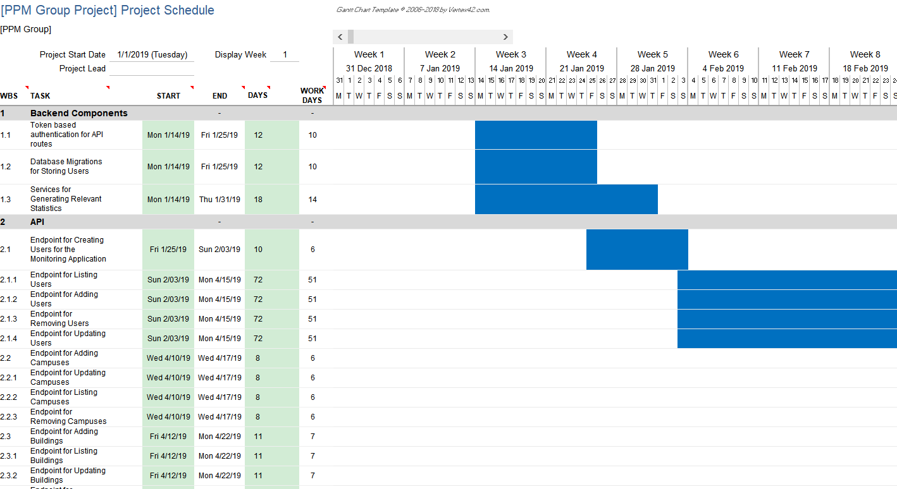

\newpage

\begin{landscape}

\pagestyle{empty}

\hypertarget{pert-chart}{%
\section{PERT Chart}\label{pert-chart}}

\begin{figure}
    \makebox[\linewidth]{
		\includegraphics[width=1\linewidth]{images/ppm-images/pert-chart.png}
    }
	\caption{PERT Chart} \label{fig:pert-chart}
\end{figure}

\end{landscape}

\newpage

# Logical ERD

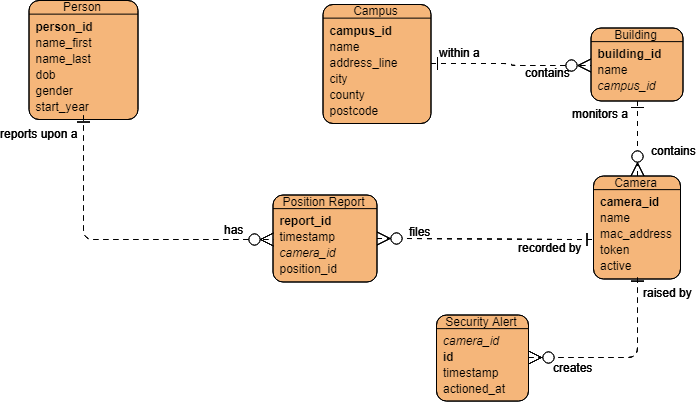
The ERD represents the database structure with the data in the third normalised form. It shows the relationship between the entitites within the application, in addition to the keys and cardinalities. 

\newpage

# Process flow for Camera

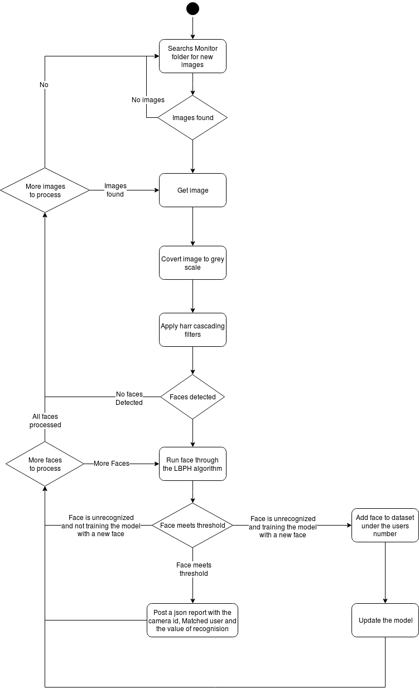{width=70%}

\newpage
## Algorithm Explanation

### Facial Detection

For the facial detection portion of the program the haar cascading classifiers is used, with a pre trained model of faces. Haars works by extracting all useful filters from an image, it does this with the below image. Each feature is a value obtained by subtracting a sum of pixels from under the white section from the sum of pictures under the black section.
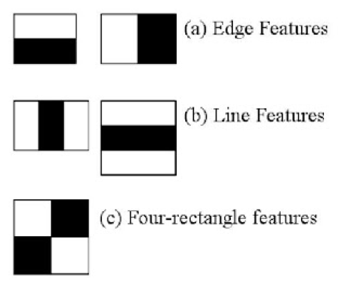
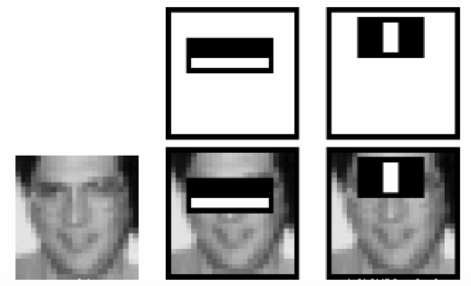

Each filter will be placed at every available size of the image some will be useful other won't be, but this is where the problems start, doing this for a 24x24 pixel image will use over 160000 features. This is very time consuming which is where the power of haar comes in. It applies the filters in a cascading fashion. Applying one set and if all of the comeback positive, the next set will be used this is very beneficial as it help weed out areas that aren't faces quicker. An image that passes all states of the cascade will be returned with the information of the region the contains the space. [@opencv]

### Facial Recognition

For the facial recognition the Local Binary Pattern Histograms (LBPH) was used. This method excels at its efficiency in terms of computational power, working by taking in a grayscale image and for every pixel gets the 8 neighbors' pixel values.  If there below a threshold then the cell is given a zero - else it's given a one, a binary number is then constructed from the cells and this is that positions new color value.
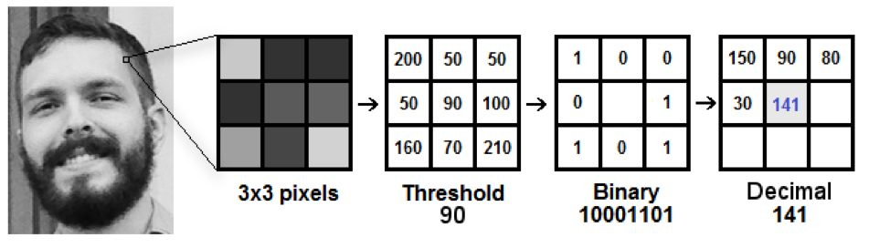
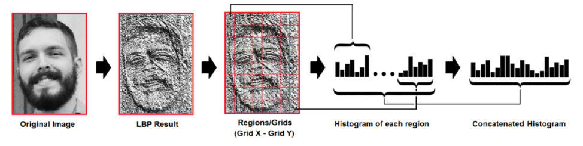

This new image better represents the features of the original image, as it stores a histogram for how many occurrences there are of each brightness value. This is then compared with a trained model and the closest neighbor is found. A match will always be given back this is why a threshold need to be implemented as a value too far away from the original is unlikely to be a positive match. [@salton_prado_salton_prado_2017]

\newpage

## BCS Code of Conduct

In order to make our project as efficient as possible, the group decided that it will essential to use the British Computer Society’s (BCS) code of conduct, so it can guide us with professional standards and be aware of our responsibilities to each other and the public. 

All of our decisions were made with the BCS code of conduct in mind. In order to keep our work professional, with competence and integrity, we made sure to thoroughly research and be up to date with the latest technology and techniques for our respective parts in this project. As it states in the BCS code of conduct “develop your professional knowledge, skills and competence on a continuing basis, maintaining awareness of technological developments, procedures, and standards that are relevant to your field.” [@bcs].

Because of the nature of this project, working in a group, we ensured that everyone in the group had the same rights and authority toward the project. Everyone’s thoughts and opinions were taken into account , no matter the content, everyone had a voice and no one could contradict that, not only it is immoral it is enforced  by the (BCS) code of conduct “respect and value alternative viewpoints and, seek, accept and offer honest criticisms of work.” [@bcs].

With that said this brings us to another matter, any form of discrimination was prohibited, not only it’s immoral, it is also illegal. The Equality Act 2010 and the BCS code of conduct state that any kind of discrimination is not allowed “conduct your professional activities without discrimination on the grounds of sex, sexual orientation, marital status, nationality, colour, race, ethnic origin, religion, age or disability, or of any other condition or requirement” [@bcs].

It is important to say that we worked on this project for the public interest. We wanted to provide security and efficiency. With this product we want to saver time for the public and make there lives easier. Of course, the privacy of the public is our priority, we implemented restricted access to our product, so only personal that have a username and password can access the private data. With the BCS code of conduct stating, “You shall have due regard for public health, privacy, security and wellbeing of others and the environment.” [@bcs].

\newpage

# Discussion / Conclusion 

As a result of this project, the group has created a basic facial recognition system which records the location of a ‘hit’ (where the camera has successfully recognised a person based upon a pre-defined database of pictures). The cameras are designed to run on a lightweight device (demonstrated as a proof-of-concept on a Raspberry Pi) to allow the system to be cost-effective and for cameras to be in potentially secretive locations (depending on the use case). To monitor the data, a dashboard presenting all this information to relevant security personnel has also been created. From here, users of the dashboard can administer those people whom are known to the system, monitor activity in a specific location and action alerts of unknown reports in the places. 

The big challenge and learning experience with this project were producing a system which wasn’t just an academic exercise. Producing a system which had the potential to be used to improve the safety and security of our peers and the staff on campus was a rewarding concept when the group first agreed on the proposal. It required for a large pool of skills to be brought together and managed in a way which provided the best results based upon our aims and requirements. With other modules at university often taking varying degrees of priority through the course of the project, it was important to set reasonable goals and help people manage their workloads. Much of the group were in the same group so could empathise with the conflict between this project and other assignments at university. We prepared for this well using the risk assessment responses and producing a clear list of tasks using a GANTT chart and other methods such as a shared to-do list between our intra-project ‘teams’. Planning a lot of the tasks out in advance allowed members to manage their workloads effectively.  

Facial recognition technology, coupled with artificial intelligence and machine learning, are very much emerging technologies which are at the cutting edge of research. For a group of undergraduate students, despite the collective experience of the group the system we have produced in just 5 months only scratches the surface as to what this concept can do. Learning skills in this field could be useful for future employment as companies may seek to utilise these technologies at a greater rate. 

## Social, Legal & Ethical Issues 

This technology could be perceived as being highly invasive on people and their civil liberties. By storing the location of people, including exact timestamps, not to mention their photograph to cross-reference, causes some ethical issues.  

Data on the whereabouts of people in the wrong hands could lead to the safety of people and their homes (e.g. a burglary) could be compromised. If this project was to enter the real world on the scale to make it useful, there would have to be significant consideration and training given to the personnel whom use the system to ensure that this scenario doesn’t occur. People also might not feel comfortable making such a binary decision as whether they are perceived as a ‘threat’ due to them not being known to the system. Therefore, the project still carries a human element with respect to flagging potentially harmful situations, to ensure the computer is not making all of the decisions but supporting that of the human by providing more in-depth information on a given scenario. 

Technologies for facial recognition (FRS) require machine-learning algorithms that have been trained with data to recognise facial features’. Many factors play into account that affect the match like the quality of the database image (pixel, size, lighting, etc.), the quality of the captured image, the algorithmic performance and more. The important aspect of the use of this technology is the operator and their response. The software itself does nothing but output its matches, it is the operator that will decide what to do with the information. The concern here is that if the software results in an inaccurate output and generates many matches the operator might act without verifying the accuracy of the match. Therefore, ethical principles must be in place. [@porter_uncategorized]

UK Government guidelines relating to the use of facial recognition software [@porter_uncategorized] state that ethical issues include, but are not limited to:
- The use of the software can be used only if it benefits and serves the public interest.
- The use of the software can be used only if it is a reliable tool to identify people.
- If the software has unequal and discriminatory results should be open to careful examination and effective oversight.
- Images and information should have appropriate security measures to prevent unauthorised access and use.

The group believes these principles should be followed with future developments of the system by improving the reliability of the recognition algorithm. Keeping those people on areas such as a campus serves in the public interest but some work might still be required to optimise its uses in other use cases and locations. The images are transferred between areas of the system using secure methods of communication HTTPS to ensure that the data doesn't get intercepted.

## Future Work 

As previously mentioned, this could be considered to be a basic implementation of both the facial recognition algorithms and the way the data about identification is recorded. Optimisations for the future could include improving the speed, reliability and scalability of the algorithm and camera feeds. These variables are still unknown given the limited scale of this project but has been developed in such a way which would make these things feasible. 

In terms of work not complete, the group would like to have integrated this system with the ability to capture attendance for academic sessions within the university. This was defined as one of our stretch goals at the start of the project but due to limited time and technical limitations, this was not attainable in the given timeframe. 

In the future, the system could also be integrated with the local police facial recognition database in order to identify unknown people automatically, not only would this allow security personnel to understand who is on campus without having to manually intervene (providing the person exists in the Police database), but it would also allow for security personnel to immediately identify criminals or unwanted people that are on campus. 

\newpage

# Appendix

## Use Cases

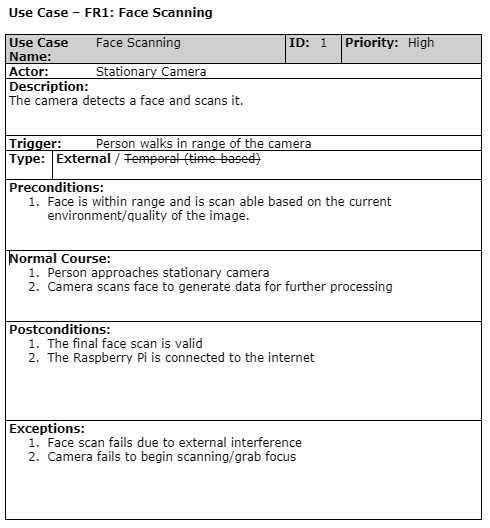
\newpage

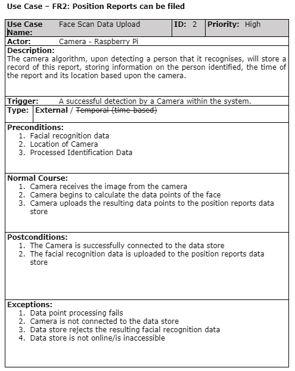
\newpage

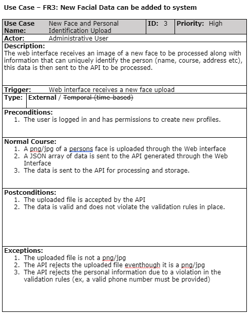
\newpage

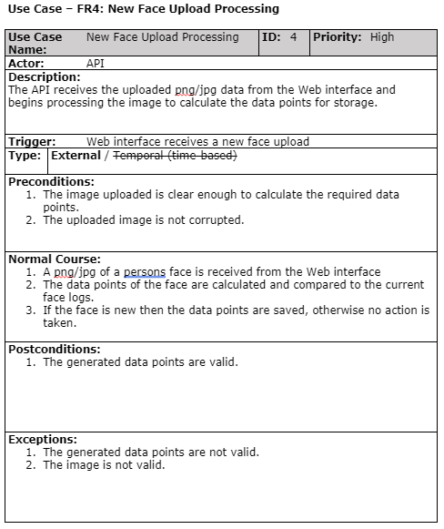
\newpage

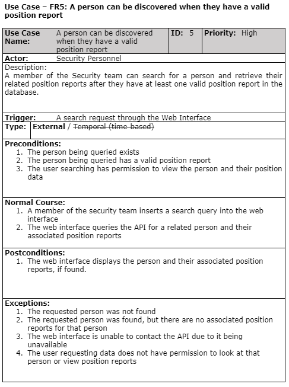
\newpage

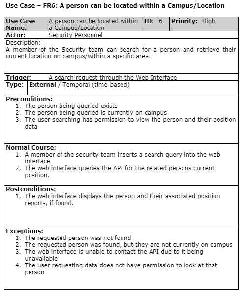
\newpage

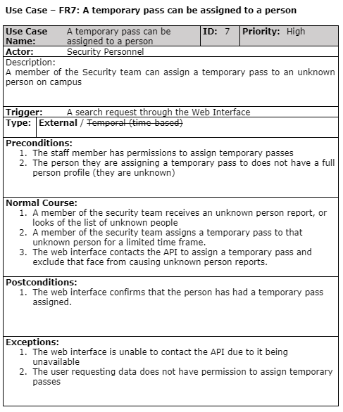
\newpage

## Test Plan

We have performed extensive testing on our application, whenever a new feature is pushed to GitHub all related group members perform testing before it is pushed to the master branch and released. We also have far reaching Unit Tests that ensure the APIs features are working correctly and that suitable data is being returned.

Below you can find testing results in relation to our Web Application

| Test No | Requirement                                                                 | Type of Test | Expected Result                                                                                                                                         | Actual Result | Workaround  | Retest |
| :-----: | --------------------------------------------------------------------------- | ------------ | ------------------------------------------------------------------------------------------------------------------------------------------------------- | ------------- | ----------- | ------ |
|    1    | Inputting correct login credentials logs into the website.                  | Valid        | The website will load into the dashboard page.                                                                                                          | As expected   | N/A         | N/A    |
|    2    | Inputting incorrect login credentials denies access to the website.         | Valid        | The user will receive a message informing them to correctly log in.                                                                                     | As expected   | N/A         | N/A    |
|    3    | Checking the remember me box will allow the site to remember the user.      | Valid        | Checking the remember me box will allow the site to remember the user.                                                                                  | As expected   | N/A         | N/A    |
|    4    | The dashboard button redirects the user to the dashboard page.              | Valid        | On activation of the dashboard button, the user will be taken to the dashboard.                                                                         | As expected   | N/A         | N/A    |
|    5    | The dashboard loads and displays all required data correctly.               | Valid        | On load the dashboard populates all fields on the page from given resources.                                                                            | As expected   | N/A         | N/A    |
|    6    | The dashboard displays relevant and current data of detection data.         | Valid        | The camera detections table is populated with relevant detection data.                                                                                  | As expected   | N/A         | N/A    |
|    7    | The dashboard displays information on campus locations and buildings.       | Valid        | The campus capacities table will be populated with relevant locational data.                                                                            | As expected   | N/A         | N/A    |
|    8    | The statistics button will redirect the user to the statistics page.        | Valid        | On activation of the statistics button, the user will be taken to the statistics page.                                                                  | As expected   | N/A         | N/A    |
|    9    | The statistics page will display relevant activity data.                    | Valid        | On load the statistics page will be populated with general data of the system.                                                                          | As expected   | N/A         | N/A    |
|   10    | The statistics page can show specifically student data.                     | Valid        | On button press of the student button, the activity graph will change to specifically show student data.                                                | As expected   | N/A         | N/A    |
|   11    | The statistics page can show specifically staff data.                       | Valid        | On button press of the staff button, the activity graph will change to specifically show staff data.                                                    | As expected   | N/A         | N/A    |
|   12    | The statistics page can show specifically guest data.                       | Valid        | On button press of the guest button, the activity graph will change to specifically show guest data.                                                    | As expected   | N/A         | N/A    |
|   13    | The statistics page can show general data of the system.                    | Valid        | On button press of the general button, the activity graph will change to show all user data.                                                            | As expected   | N/A         | N/A    |
|   14    | The statistics page graph presents current and relevant data.               | Valid        | On draw the graph will display date by date information for each location for each user type.                                                           | As expected   | N/A         | N/A    |
|   15    | The statistics graph can be used to view past data.                         | Valid        | On load the graph presents the past 30 days of data, though after pressing the 30, 60 or 90-day button the corresponding data will be displayed.        | As expected   | N/A         | N/A    |
|   16    | The statistics page shows current locational data.                          | Valid        | On load the current campus activity table will be filled with current locational activity, showing the spread of people across the campus.              | As expected   | N/A         | N/A    |
|   17    | The Administration button will redirect the user to the admin page.         | Valid        | On activation, the button will take the user to their administration page, suited to their access level.                                                | As expected   | N/A         | N/A    |
|   18    | The admin page displays all current system users.                           | Valid        | On activation, the button will take the user to their administration page, suited to their access level.                                                | As expected   | N/A         | N/A    |
|   19    | The admin page allows the user to find another users profile.               | Valid        | If the user has correct privileges, using the view profile button will take the user to the selected user’s profile.                                    | As expected   | N/A         | N/A    |
|   20    | The admin page allows the user to edit another users profile.               | Valid        | The admin page allows the user to edit another users profile.                                                                                           | As expected   | N/A         | N/A    |
|   21    | The admin page allows the user to delete another user.                      | Valid        | If the user has correct privileges, using the edit button will allow the user to edit the selected user’s information.                                  | As expected   | N/A         | N/A    |
|   22    | The admin page will show data relevant to buildings and locations.          | Valid        | On selecting the campuses and buildings tab the page will show connected buildings and campuses. This will also display their respective status.        | As expected   | N/A         | N/A    |
|   23    | The admin page allows the user to view data on locations and buildings.     | Valid        | If the user has correct privileges, on selected the view info button the user will be taken to a page containing data on the selected location.         | As expected   | N/A         | N/A    |
|   24    | The admin page allows the user to edit locations and buildings data.        | Valid        | If the user has correct privileges, on selecting the edit data button the user will be able to edit the selected locations data.                        | As expected   | N/A         | N/A    |
|   25    | The admin page will allow the user to delete locations and buildings.       | Valid        | If the user has correct privileges, on selecting the delete button, the selected location will be deleted form the system.                              | As expected   | N/A         | N/A    |
|   26    | The admin page will show the camera and connection status of each location. | Valid        | The campuses and buildings tab will automatically show the current status of the registered locations.                                                  | As expected   | N/A         | N/A    |
|   27    | The admin page will allow the user to browse data of registered locations.  | Valid        | On selection of a location it will display all ‘sublocations’ associated with the location.                                                             | As expected   | N/A         | N/A    |
|   28    | The admin page will allow the user to view all registered cameras .         | Valid        | On selection of the cameras tab, the page will then show a table of all of the registered cameras.                                                      | As expected   | N/A         | N/A    |
|   29    | The admin page will show all relevant data regarding cameras.               | Valid        | On selection of the cameras tab, the cameras table displays relevant technical information about each camera as well as its status.                     | As expected   | N/A         | N/A    |
|   30    | The admin page will allow the user to inspect cameras.                      | Valid        | If the user has correct privileges, on selection of the view camera button, the user will be able to view relevant data of the camera they selected.    | As expected   | N/A         | N/A    |
|   31    | The admin page will allow the user to edit camera data.                     | Valid        | If the user has correct privileges, on selection of the edit button the user will be able to edit the selected cameras data.                            | As expected   | N/A         | N/A    |
|   32    | The admin page will allow the user to remove cameras.                       | Valid        | If the user has correct privileges, on selection of the delete button, the camera that has been selected will be removed from the system.               | As expected   | N/A         | N/A    |
|   33    | The alerts button will navigate the user to the alerts page.                | Valid        | On activation of the alerts button the user will be taken to the alerts page of their permissions.                                                      | As expected   | N/A         | N/A    |
|   34    | The alerts page will show information about alert events.                   | Valid        | On load the alerts page will display all of the recent unacknowledged alerts of the system and relevant information.                                    | As expected   | N/A         | N/A    |
|   35    | The alerts page generates relevant and important alerts.                    | Valid        | The alerts page will be updated whenever there is an unknown person detected by the cameras and remain until acknowledged.                              | As expected   | N/A         | N/A    |
|   36    | The alerts page allows the user to acknowledge the alerts.                  | Valid        | The user will be able to acknowledge each of the alerts through either pressing the false negative button or the resolved button.                       | As expected   | N/A         | N/A    |
|   37    | The Profile button will take the user to their personal profile.            | Valid        | Upon activation of the button, the user will be taken to their personal profile page with their own data.                                               | As expected   | N/A         | N/A    |
|   38    | The profile page will display safe and relevant personal data of the user.  | Valid        | On load the profile page will display the users name, course or profession, and year.                                                                   | As expected   | N/A         | N/A    |
|   39    | The profile page will display the users positioning.                        | Valid        | On load, the profile will display the users current and most favoured position, in the case that the user’s current position is false.                  | As expected   | N/A         | N/A    |
|   40    | The profile page will display the users past positioning.                   | Valid        | On load, the page will load the most recent data regarding the users previous positioning. This will be displayed in the detections table.              | As expected   | N/A         | N/A    |
|   41    | The profile page will indicate a user’s activity.                           | Valid        | Within the detections table an academic column indicates if an action was academic related or not.                                                      | As expected   | N/A         | N/A    |
|   42    | The profile page will show a user’s habits.                                 | Valid        | On load the user’s favoured location will be shown, as well as an activity table which shows a breakdown of the user’s total recorded action locations. | As expected   | N/A         | N/A    |
|   43    | The logout button will have the desired effect when used.                   | Valid        | Upon activating the logout button, the logout protocol will begin.                                                                                      | As expected   | N/A         | N/A    |
|   44    | The user will be able to safely log out of the system.                      | Valid        | Upon use of the logout button the user’s session will be ended and will need to re-login.                                                               | As expected   | N/A         | N/A    | 

## Screen Designs

### Login

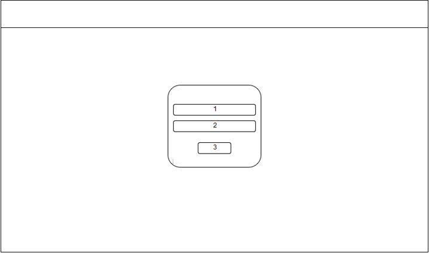

The login page will be the first page that the user will interact with. This will require a username / email and password to be entered in order to access the website. This will also contain a ‘Forgotten Password’ button to give extra assistance to the user. 

\newpage

### Dashboard

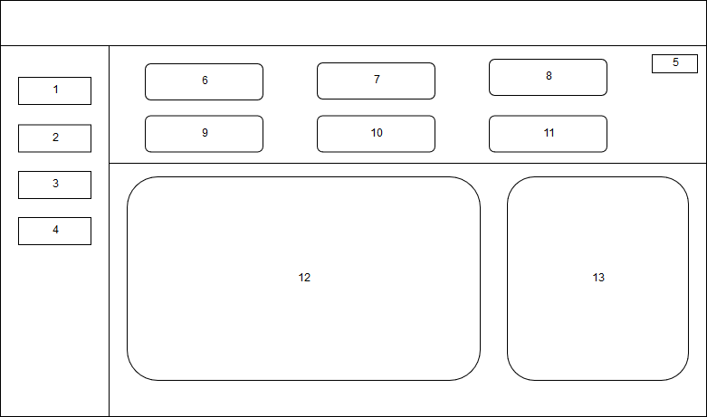

The dashboard will be the first screen that the user views after logging in. This page will display general details about the system and how it is preforming, giving specific updates on new users, detections, unknown detections, etc. This will also show specific data on camera activity, showing which cameras have detected what user type, or if it has detected and invalid user.   

\newpage

### Statistics

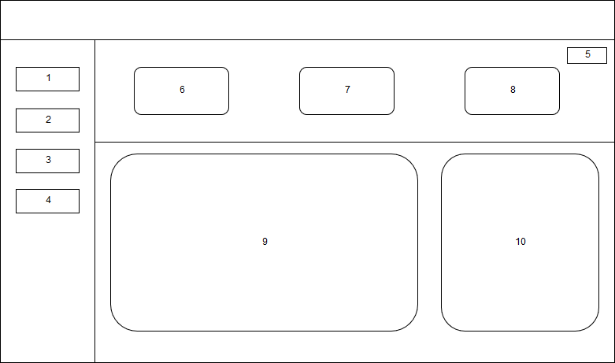

The statistics page will show the user all of the relative data regarding user activity. This page includes a graph which will show specified user activity between campus locations. The specified user will be changeable by a set of buttons at the top of the screen. The statistics page will also display campus activity in specific buildings.  
\newpage

### Admin

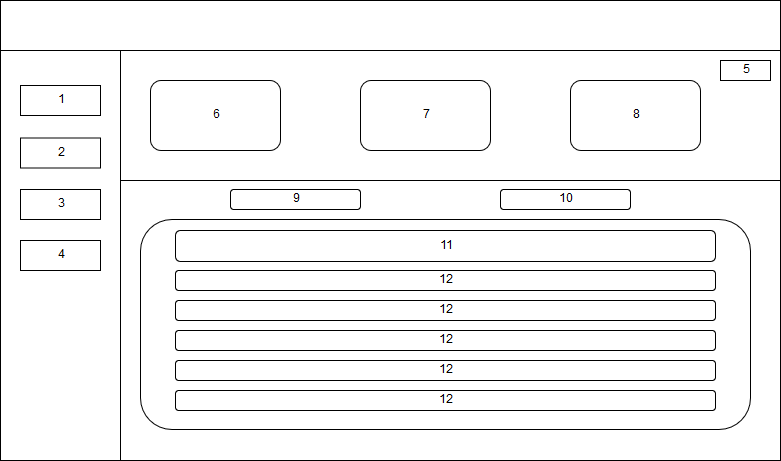

The admin page will allow the user the create and edit data. This data may be regarding a permanent user, temporary user, or a camera. This page will be used in order to view users’ profiles, add users, edit current user’s data, find specific locational data and also find specific camera data.  
\newpage

### User Profile

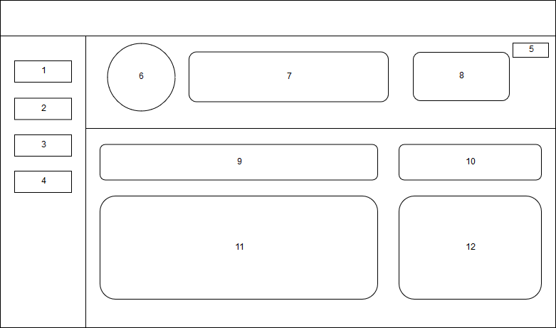

The profile page will show the user the chosen user’s profile information. This will contain basic information about the user, including name, course, year, attendance, location, and activity. The default user for this page will be the profile that is associated with the current log-in. Other user’s will be able to be accessed by the admin page through selecting a user and then the profile button.  
\newpage

### Elements Appendix

Login: 

1. Username Input
2. Password Input  
3. Sign in Button  
   
Dashboard: 

1. Dashboard 
2. Profile 
3. Statistics              
4. Admin          
5. Logout         
6. Total Users Detected 
7. New Users
8. Valid Detections
9. Invalid Detections
10. Most Used Cameras
11. Current Campus Population
12. Camera Details (Detections)
13. Location Details (Population)                                                                         

Statistics: 

1. Dashboard
2. Profile 
3. Statistics
4. Admin
5. Logout  
6. "Students" Button
7. "Teachers" Button
8. "Guests" Button
9. Specified User Activity Graph
10. Locational Data (Population %)
 

Admin: 

1. Dashboard 
2. Profile
3. Statistics 
4. Admin
5. Logout
6. Total Users
7. Current Population
8. Invalid Detections
9. Users Tab
10. Cameras and Locations Tab
11. Data Table Categories
12. Records of Data Table

Profile: 

1. Dashboard
2. Profile  
3. Statistics
4. Admin
5. Logout
6. Profile Image
7. Basic Data (Name, Course)
8. Attendance
9. Current Location
10. Favoured Location
11. Detections Table
12. Total Activity Breakdown
\newpage

## Test Plan

## UI Screenshots

### Login Page
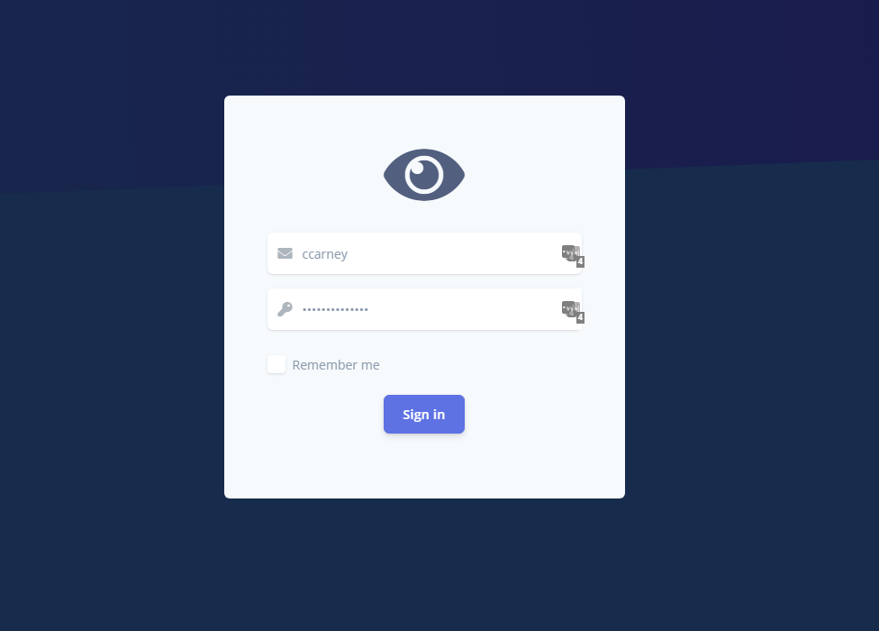
\newpage

### Dashboard
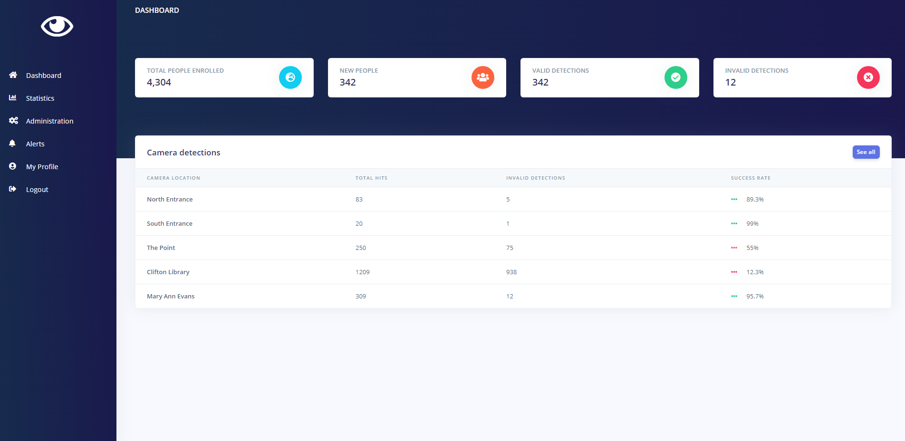
\newpage

### Administrative Dashboard - Users
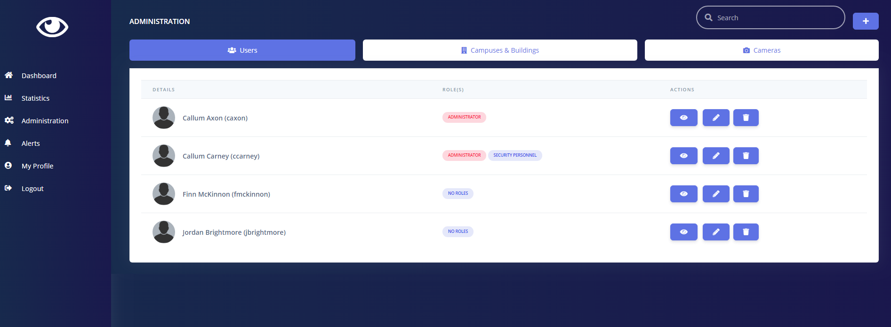
\newpage

### Administrative Dashboard - Buildings
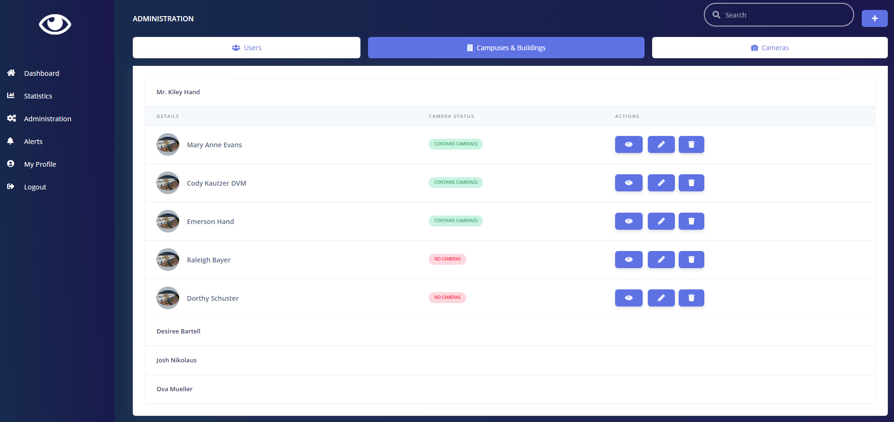
\newpage

### Administrative Dashboard - Cameras
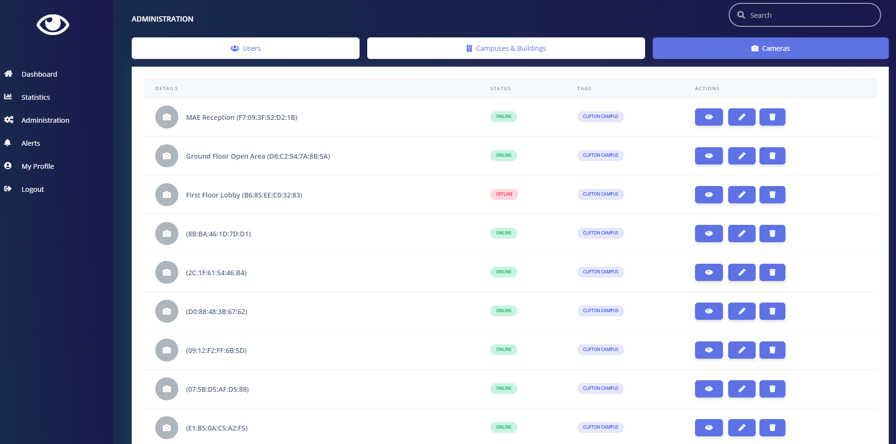
\newpage

### Alerts
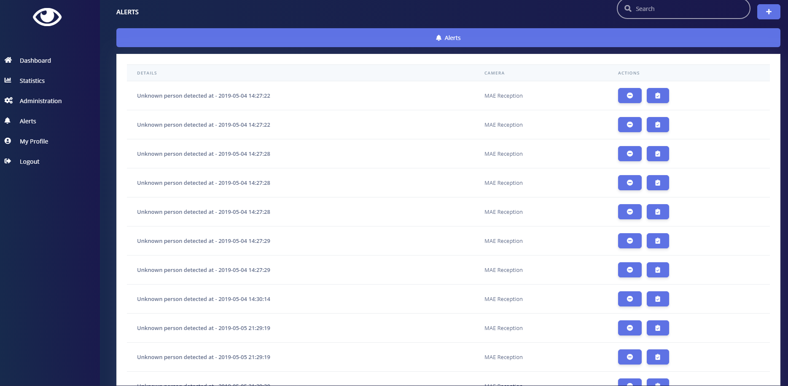
\newpage

### User Profile
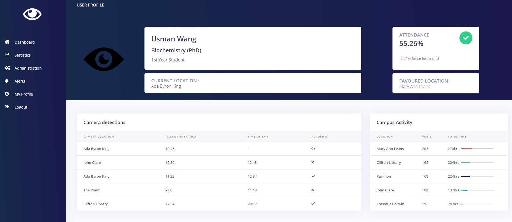
\newpage

## Questionnaire Responses

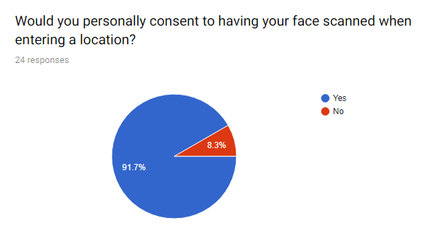
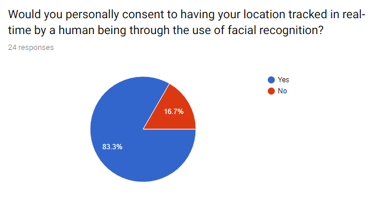
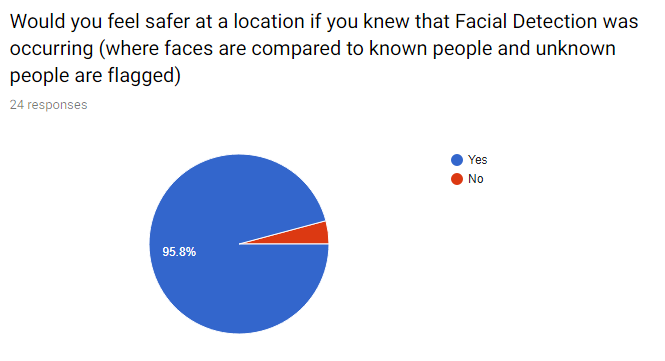
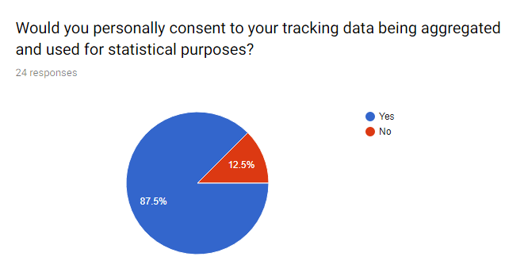
\newpage

# References
